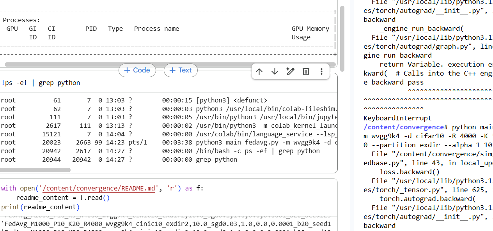
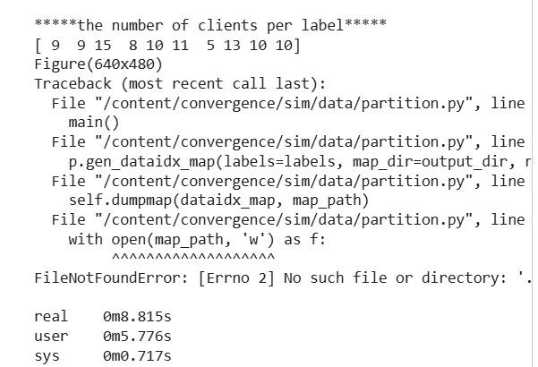
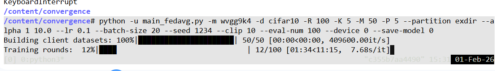
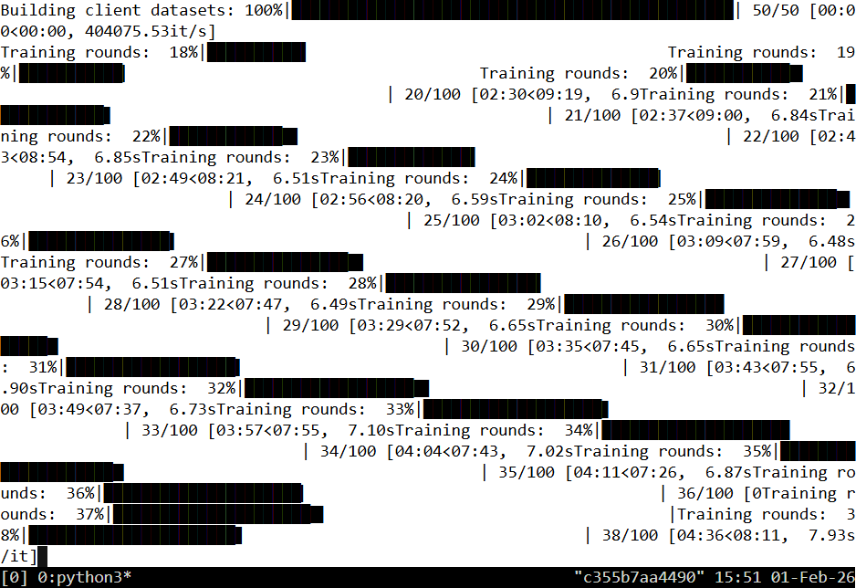

根据代码分析，数据集会自动下载，不需要手动准备。

Read f:\科研\ecust\方向\联邦\强化\convergence\sim\data\datasets.py
数据集下载情况
数据集	下载方式	说明
MNIST	✅ 自动下载	download=True，首次运行自动下载
Fashion-MNIST	✅ 自动下载	download=True，首次运行自动下载
CIFAR-10	✅ 自动下载	download=True，首次运行自动下载
CIFAR-100	✅ 自动下载	download=True，首次运行自动下载
CINIC-10	❌ 需手动下载	使用 ImageFolder，需要自己准备
CINIC-10 手动下载
如果要用 CINIC-10 数据集，需要手动下载并解压到 ../datasets/CINIC-10/ 目录：


# 下载地址
https://datashare.ed.ac.uk/handle/10283/3192

# 目录结构应为：
../datasets/CINIC-10/
├── train/
│   ├── airplane/
│   ├── automobile/
│   └── ...
└── test/
    ├── airplane/
    └── ...
其他数据集
直接运行代码即可，数据会自动下载到 ../datasets/ 目录（即项目上一级的 datasets 文件夹）。
python main_fedavg.py -m mlp -d mnist -R 100 -K 5 -M 50 -P 5 --partition exdir --alpha 1 10.0 --lr 0.1 --batch-size 20 --seed 1234 --clip 10 --eval-num 100 --device 0 --save-model 0



**不会重新分区**，代码会直接读取预生成的分区文件。

### 执行流程


```
--partition exdir --alpha 1 10.0 -M 500 -d cifar10
                    ↓
拼接文件路径: ./partition/cifar10_M[500]_exdir[1 10.0].txt
                    ↓
直接读取 JSON 文件，获取 dataidx_map
                    ↓
使用这个 map 构建各客户端的本地数据集
```

### 代码逻辑（partition.py:20-31）


```python
def build_partition(dataset_name, num_clients, partition, alpha):
    map_dir = './partition/'
    # 拼接文件路径
    map_path = "{}/{}_M[{}]_{}[{} {}].txt".format(
        map_dir, dataset_name, num_clients, partition, C, alpha
    )
    # 直接读取，不重新生成
    dataidx_map = Partitioner.read_dataidx_map(map_path)
    return dataidx_map
```

### 总结

| 情况           | 行为                     |
| -------------- | ------------------------ |
| 分区文件存在   | 直接读取，不重新分区     |
| 分区文件不存在 | 报错 `FileNotFoundError` |

所以你之前用 `M=50` 报错就是因为没有对应的预生成文件。预生成分区文件的目的就是**保证实验可复现**——每次运行使用完全相同的数据划分。

预设的分区文件只是数据索引的映射（哪些样本属于哪个客户端），但程序还需要：

实际执行的步骤

1. 读取分区文件 (很快，JSON文件)
   ↓
2. 下载/加载 CIFAR-10 数据集 (首次需下载)
   ↓
3. 为 500 个客户端构建本地数据集 ← 慢在这里！
   for i in range(500):
       Subset(overallset, indices[i])  # 每个客户端创建一个子集
   ↓
4. 开始训练
为什么第 3 步慢？
根据 README 中提到的 "Way 1" 方法：


# 每个客户端的数据集构建时会触发 transform（数据增强）
self.fedsets.append(Subset(overallset, net_dataidx_map[i]))
500 个客户端
每个客户端要处理其数据索引
CIFAR-10 有 50000 张训练图片
数据增强（RandomCrop, RandomHorizontalFlip）需要计算
这是正常的
首次运行慢是预期行为。等数据准备完成后，训练就会开始输出：


Round 4, test_acc: xx.xx%
Round 8, test_acc: xx.xx%
...
继续等待即可，或者按 Ctrl+C 中断后用 -u 参数查看实时进度：


python -u main_fedavg.py -m wvgg9k4 -d cifar10


那我想快速验证怎么办 分区里面好像全是 500 1000 的客户端啊 意思需要自己构建分区
是的，如果想快速验证，有两个选择：

方法 1：减少训练轮数（推荐，最简单）
客户端数量不变，但减少 -R 和 --eval-num：


python -u main_fedavg.py -m wvgg9k4 -d cifar10 -R 20 -K 5 -M 500 -P 10 --partition exdir --alpha 1 10.0 --lr 0.1 --batch-size 20 --seed 1234 --clip 10 --eval-num 20 --device 0 --save-model 0
数据准备只需要一次，之后训练 20 轮很快。

方法 2：生成小规模分区文件

cd sim/data
python partition.py -d cifar10 -n 50 --partition exdir -C 1 --alpha 10.0
然后把生成的文件移动到 ./partition/ 目录，再运行：


python -u main_fedavg.py -m wvgg9k4 -d cifar10 -R 100 -K 5 -M 50 -P 5 --partition exdir --alpha 1 10.0 --lr 0.1 --batch-size 20 --seed 1234 --clip 10 --eval-num 100 --device 0 --save-model 0
方法 3：用 MNIST（更轻量）
MNIST 数据集更小，模型也更简单：


python -u main_fedavg.py -m mlp -d mnist -R 100 -K 5 -M 500 -P 10 --partition exdir --alpha 1 10.0 --lr 0.1 --batch-size 20 --seed 1234 --clip 10 --eval-num 100 --device 0 --save-model 0
建议
先用方法 1，等数据准备完成后（第一次慢），后续运行会快很多，因为数据集已经下载好了。

个错误是因为分区文件生成时使用了错误的数据集。

看 partition.py 的代码：

Read f:\科研\ecust\方向\联邦\强化\convergence\sim\data\partition.py (lines 319-343)
发现问题了！partition.py 第 322 行有 bug：


# 这里写死了 'mnist'，没有使用参数 dataset_name
train_dataset, test_dataset = build_dataset(dataset_name='mnist', dataset_dir=dataset_dir)
所以无论你指定 -d cifar10，它都用 MNIST 的数据生成分区（60000 样本），导致索引超出 CIFAR-10 的范围（50000 样本）。

解决方案
手动修复 partition.py 第 322 行，把 'mnist' 改成 dataset_name：


# 修改前
train_dataset, test_dataset = build_dataset(dataset_name='mnist', dataset_dir=dataset_dir)

# 修改后
train_dataset, test_dataset = build_dataset(dataset_name=dataset_name, dataset_dir=dataset_dir)
然后重新生成分区：


cd sim/data
python partition.py -d cifar10 -n 50 --partition exdir -C 1 --alpha 10.0
再把生成的文件移动到 ./partition/ 目录，然后运行实验。

或者直接用已有的分区
不想改代码的话，直接用已有的 M=500 分区，减少训练轮数：


python -u main_fedavg.py -m wvgg9k4 -d cifar10 -R 20 -K 5 -M 




能不能设计什么进度条 python -u main_fedavg.py -m wvgg9k4 -d cifar10 -R 100 -K 5 -M 50 -P 5 --partition exdir --alpha 1 10.0 --lr 0.1 --batch-size 20 --seed 1234 --clip 10 --eval-num 100 --device 0 --save-model 0 感觉五十个都要好久啊


/content/convergence# python -u main_fedavg.py -m wvgg9k4 -d cifar10 -R 100 -K 5 -M 50 -P 5 --partition exdir --alpha 1 10.0 --lr 0.1 --batch-size 20 --seed 1234 --clip 10 --eval-num 100 --device 0 --save-model 0 Building client datasets: 100%|█████████████████████| 50/50 [00:00<00:00, 400985.09it/s] 然后没动静了？ 还是一样啊 不是dataset问题吧


你说得对，`Subset` 只是创建索引引用，非常快（400985 it/s）。真正慢的地方在**训练循环**中。让我看看主训练代码。

**Read** [f:\科研\ecust\方向\联邦\强化\convergence\main_fedavg.py](vscode-webview://0jkqm9gckmkc849or20jbci4f22fuulq2s72p1nvpnej9ns9f4j2/index.html?id=0562965b-7605-4dd1-9ff3-65f8c77b5a9b&parentId=1&origin=e2124d81-7610-4fed-98cf-fa4d9033cd0a&swVersion=4&extensionId=Anthropic.claude-code&platform=electron&vscode-resource-base-authority=vscode-resource.vscode-cdn.net&parentOrigin=vscode-file%3A%2F%2Fvscode-app&session=7aacf5f2-e61c-4619-a9ed-57501131c010#)

找到问题了！慢的地方是**训练循环**（第 109-120 行），而且默认 `--log ''` 没有输出。让我在训练循环添加进度条：

**Edit** [f:\科研\ecust\方向\联邦\强化\convergence\main_fedavg.py](vscode-webview://0jkqm9gckmkc849or20jbci4f22fuulq2s72p1nvpnej9ns9f4j2/index.html?id=0562965b-7605-4dd1-9ff3-65f8c77b5a9b&parentId=1&origin=e2124d81-7610-4fed-98cf-fa4d9033cd0a&swVersion=4&extensionId=Anthropic.claude-code&platform=electron&vscode-resource-base-authority=vscode-resource.vscode-cdn.net&parentOrigin=vscode-file%3A%2F%2Fvscode-app&session=7aacf5f2-e61c-4619-a9ed-57501131c010#)

Added 1 line





